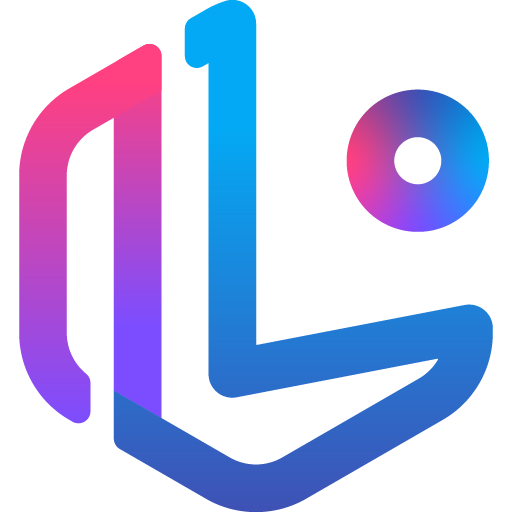

  

  

<h1 align="center">안녕하세요, 아이엔입니다 👋</h1>

  <strong>이현우 IENGROUND</strong> 
  모바일 개발자 · 웹 개발자 · 그래픽 디자이너

  <a href="https://www.ien.zone/project" title="포트폴리오">
    <picture>
      <source media="(prefers-color-scheme: dark)" srcset="icons/icon-global-dark.svg" />
      <source media="(prefers-color-scheme: light)" srcset="icons/icon-global-light.svg" />
      
    </picture>
  </a>
  &nbsp;&nbsp;
  <a href="https://github.com/ienground" title="GitHub">
    <picture>
      <source media="(prefers-color-scheme: dark)" srcset="icons/icon-github-dark.svg" />
      <source media="(prefers-color-scheme: light)" srcset="icons/icon-github-light.svg" />
      
    </picture>
  </a>
  &nbsp;&nbsp;
  <a href="https://www.instagram.com/ienlab" title="Instagram">
    <picture>
      <source media="(prefers-color-scheme: dark)" srcset="icons/icon-instagram-dark.svg" />
      <source media="(prefers-color-scheme: light)" srcset="icons/icon-instagram-light.svg" />
      
    </picture>
  </a>
  &nbsp;&nbsp;
  <a href="mailto:my@ien.zone" title="이메일">
    <picture>
      <source media="(prefers-color-scheme: dark)" srcset="icons/icon-mail-dark.svg" />
      <source media="(prefers-color-scheme: light)" srcset="icons/icon-mail-light.svg" />
      
    </picture>
  </a>
  &nbsp;&nbsp;
  <a href="https://blog.ien.zone" title="블로그">
    <picture>
      <source media="(prefers-color-scheme: dark)" srcset="icons/icon-blog-dark.svg" />
      <source media="(prefers-color-scheme: light)" srcset="icons/icon-blog-light.svg" />
      
    </picture>
  </a>

## 소개

무언가를 만드는 게 좋아서 레고 조립과 Minecraft를 즐겨했습니다. PowerPoint로 게임을 만들고, 조별과제에서는 발표 자료를 맡는 경우가 많았습니다. 한때는 자동차 디자이너를 꿈꾸기도 했고, 그래픽 디자인을 하다 현재는 코드를 직조하는 작업을 하고 있습니다. 상상하고, 만들고, 그것을 꺼내놓을 수 있다는 것보다 더 가치있고 즐거운 일이 있을까요?

2017년부터 Android 개발을 시작해 현재는 <strong>Compose Multiplatform</strong>으로 <strong>Android</strong> 및 <strong>iOS</strong> 어플리케이션을 개발하고 있습니다. 고객이 원하는 소프트웨어를 만들기 위해 많은 대화를 나누며 진행하고 있습니다. 혼자 진행해 쉴 새 없이 바쁘지만, 그만큼 고객의 프로젝트를 더 잘 이해하고 있다고 자부합니다.

## 기술 스택

| 분야 | 기술 및 도구 |
| --- | --- |
| 개발 |      |
| 디자인 |     |
| 작업 환경 |      |

  <a href="https://www.ien.zone/project" title="포트폴리오">
    <picture>
      <source media="(prefers-color-scheme: dark)" srcset="icons/icon-global-dark.svg" />
      <source media="(prefers-color-scheme: light)" srcset="icons/icon-global-light.svg" />
      
    </picture>
  </a>
  &nbsp;&nbsp;
  <a href="https://github.com/ienground" title="GitHub">
    <picture>
      <source media="(prefers-color-scheme: dark)" srcset="icons/icon-github-dark.svg" />
      <source media="(prefers-color-scheme: light)" srcset="icons/icon-github-light.svg" />
      
    </picture>
  </a>
  &nbsp;&nbsp;
  <a href="https://www.instagram.com/ienlab" title="Instagram">
    <picture>
      <source media="(prefers-color-scheme: dark)" srcset="icons/icon-instagram-dark.svg" />
      <source media="(prefers-color-scheme: light)" srcset="icons/icon-instagram-light.svg" />
      
    </picture>
  </a>
  &nbsp;&nbsp;
  <a href="mailto:my@ien.zone" title="이메일">
    <picture>
      <source media="(prefers-color-scheme: dark)" srcset="icons/icon-mail-dark.svg" />
      <source media="(prefers-color-scheme: light)" srcset="icons/icon-mail-light.svg" />
      
    </picture>
  </a>
  &nbsp;&nbsp;
  <a href="https://blog.ien.zone" title="블로그">
    <picture>
      <source media="(prefers-color-scheme: dark)" srcset="icons/icon-blog-dark.svg" />
      <source media="(prefers-color-scheme: light)" srcset="icons/icon-blog-light.svg" />
      
    </picture>
  </a>

